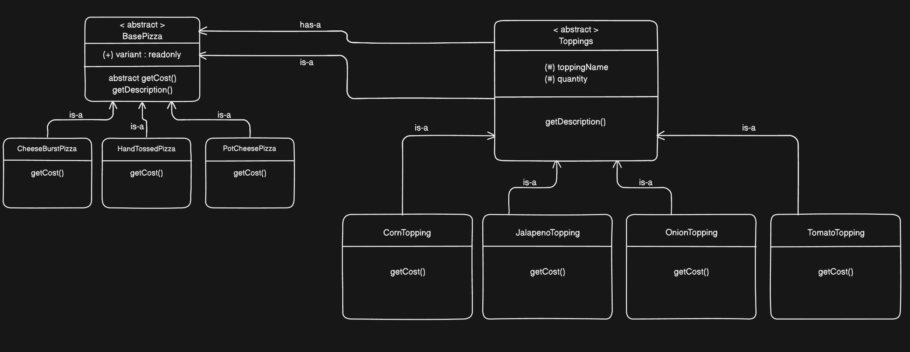

# Decorator Pattern

A TypeScript implementation of the **Decorator Design Pattern** using a pizza ordering system.

## What is the Decorator Pattern?

The Decorator Pattern attaches additional responsibilities to an object dynamically. The key insight is that a decorator **wraps** the original object and **is also of the same type** — meaning decorators can wrap other decorators infinitely, and the caller never needs to know how many layers exist.

## The Problem it Solves — Class Explosion

Adding toppings via inheritance leads to a combinatorial explosion:

```
CheeseBurstWithCorn
CheeseBurstWithOnion
CheeseBurstWithCornAndOnion
CheeseBurstWithCornAndOnionAndJalapeno
HandTossedWithCorn
... (grows exponentially)
```

With the decorator pattern, you compose at runtime:

```typescript
new OnionTopping(10, new CornTopping(10, new CheeseBurstPizza()));
```

3 base pizzas + 4 toppings = 7 classes that cover every combination.

## UML Diagram



## Key Design Decisions

**`Toppings` extends `BasePizza`**
Full inheritance means a decorated pizza passes any `BasePizza` type check, enabling infinite chaining.

**`getDescription()` implemented once in `Toppings`**
Recurses inward through the chain — each decorator calls `this.pizza.getDescription()` until it hits the base pizza. No duplication across concrete toppings.

**`getCost()` stays abstract in `BasePizza`**
Base pizzas return a fixed value, toppings compute dynamically (`wrapped cost + quantity * price`). Genuinely different behaviour so they stay in their respective concrete classes.

**`variant` is `public readonly`**
Public because the decorator reads it from the wrapped object to pass up the chain. `readonly` prevents external mutation after construction.

## How to Run

```bash
npm install
npx tsc
node dist/index.js
```

## When to Use the Decorator Pattern

- You need to add behaviour to individual objects without affecting others of the same class
- Extension by subclassing is impractical due to a large number of combinations
- Responsibilities need to be added and removed at runtime

## Real World Usage

**Express Middleware**

Each middleware wraps the request-response cycle and passes control to the next layer. This is the decorator pattern applied to functions — each layer adds behaviour without the next one knowing about it.

```javascript
const app = express();

app.use(cors()); // adds CORS headers
app.use(morgan("dev")); // adds request logging
app.use(express.json()); // adds body parsing

app.get("/user", authMiddleware, (req, res) => {
  res.json({ user: req.user });
});

function authMiddleware(req, res, next) {
  if (!req.headers.authorization)
    return res.status(401).json({ error: "Unauthorized" });
  req.user = verifyToken(req.headers.authorization);
  next(); // same as this.pizza.getCost() — passes control to the next layer
}
```

---

**React Higher Order Components (HOCs)**

A HOC wraps a component and returns a new one with added behaviour — the same is-a + has-a structure as this implementation.

```tsx
function Dashboard({ user }) {
  return <h1>Welcome, {user.name}</h1>;
}

function withAuth(Component) {
  return function AuthenticatedComponent(props) {
    if (!isLoggedIn()) return <Navigate to="/login" />;
    return <Component {...props} />;
  };
}

function withLogger(Component) {
  return function LoggedComponent(props) {
    console.log(`Rendering ${Component.name}`);
    return <Component {...props} />;
  };
}

const ProtectedDashboard = withAuth(withLogger(Dashboard));
```

---

**NestJS Decorators**

NestJS is built entirely around the decorator pattern. Every `@Controller()`, `@Get()`, `@UseGuards()`, `@Injectable()` is a decorator — it wraps your class or method and attaches behaviour that the framework executes without you writing it. Your actual business logic never knows about routing, auth, or dependency injection — decorators handle all of it as layers.

```typescript
// auth.guard.ts
import { Injectable, CanActivate, ExecutionContext } from "@nestjs/common";
import { JwtService } from "@nestjs/jwt";

@Injectable()
export class AuthGuard implements CanActivate {
  constructor(private jwtService: JwtService) {}

  canActivate(context: ExecutionContext): boolean {
    const request = context.switchToHttp().getRequest();
    const token = request.headers.authorization?.split(" ")[1];
    if (!token) return false;
    try {
      request.user = this.jwtService.verify(token);
      return true;
    } catch {
      return false;
    }
  }
}
```

```typescript
// roles.guard.ts
import { Injectable, CanActivate, ExecutionContext } from "@nestjs/common";
import { Reflector } from "@nestjs/core";

@Injectable()
export class RolesGuard implements CanActivate {
  constructor(private reflector: Reflector) {}

  canActivate(context: ExecutionContext): boolean {
    const requiredRole = this.reflector.get<string>("role", context.getHandler());
    const { user } = context.switchToHttp().getRequest();
    return user?.role === requiredRole;
  }
}
```

```typescript
// order.controller.ts — knows nothing about JWT or roles
import { Controller, Get, Post, Body, UseGuards, Req, SetMetadata } from "@nestjs/common";
import { AuthGuard } from "./auth.guard";
import { RolesGuard } from "./roles.guard";
import { OrderService } from "./order.service";

@Controller("orders")
@UseGuards(AuthGuard)               // wraps entire controller
export class OrderController {
  constructor(private orderService: OrderService) {}

  @Get()
  getAllOrders(@Req() req) {
    return this.orderService.findAll(req.user.id);
  }

  @Post()
  @UseGuards(RolesGuard)            // wraps only this route
  @SetMetadata("role", "admin")
  createOrder(@Body() body, @Req() req) {
    return this.orderService.create(body, req.user.id);
  }
}
```

```
GET /orders  →  AuthGuard → OrderController.getAllOrders
POST /orders →  AuthGuard → RolesGuard → OrderController.createOrder
```

If `AuthGuard` rejects the request, `RolesGuard` and the controller never execute — identical to how throwing in a decorator constructor stops the chain.
