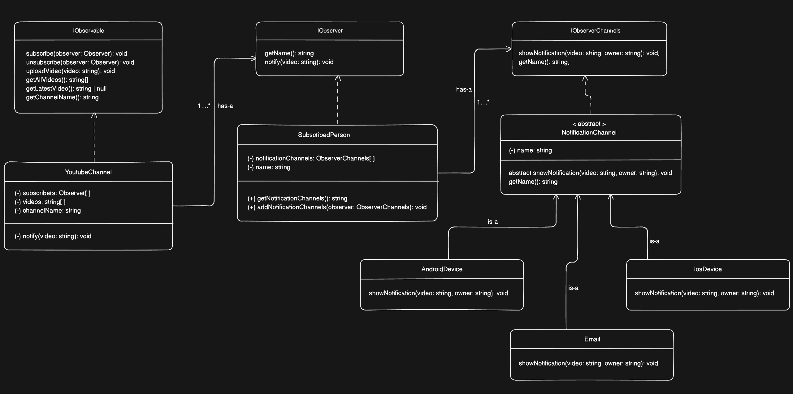

# Observer Pattern

A TypeScript implementation of the **Observer Design Pattern** using a YouTube notification system.

## What is the Observer Pattern?

The Observer Pattern defines a one-to-many relationship between objects — when one object (the **subject**) changes state, all its dependents (**observers**) are notified automatically. The subject has no knowledge of what its observers do with the notification; it just broadcasts and moves on.

## The Problem it Solves — Tight Coupling and Polling

Without the observer pattern, a YouTube channel would need to directly call each subscriber's notification method:

```typescript
uploadVideo(video: string): void {
    broad.sendAndroidNotification(video)
    broad.sendEmailNotification(video)
    root.sendIphoneNotification(video)
    butler.sendEmailNotification(video)
    // every new subscriber = modify this method
}
```

Or subscribers would have to constantly poll:
```typescript
setInterval(() => {
    if (channel.getLatestVideo() !== lastSeen) {
        notify()
    }
}, 5000)
```

Both approaches break down immediately — the first couples the channel to every subscriber, the second is wasteful and slow. The observer pattern lets the channel broadcast once and let subscribers decide what to do.

## UML Diagram



## Standard vs This Implementation

The classic Observer pattern has two layers:

```
Subject  ──notifies──▶  Observer[]
```

This implementation adds a third layer — `SubscribedPerson` is an observer of `YoutubeChannel` AND a subject to its own `NotificationChannels`:

```
YoutubeChannel  ──notifies──▶  SubscribedPerson[]  ──notifies──▶  NotificationChannel[]
   (Subject)                     (Observer +                       (AndroidDevice,
                                  Subject)                          IoSDevice, Email)
```

This mirrors how YouTube actually works — the platform notifies your account, your account notifies your devices. `SubscribedPerson` sits in the middle of two observer relationships simultaneously.

## Key Design Decisions

**Two-level observer architecture**
`YoutubeChannel` notifies `SubscribedPerson`, who in turn notifies their own `NotificationChannels`. A person is an observer of a channel AND a subject to their own devices. This mirrors how YouTube actually works — the platform notifies your account, your account notifies your devices.

**`notify()` is private in `YoutubeChannel`**
External code cannot trigger notifications directly. Only `uploadVideo()` can — enforcing that notifications are always tied to an actual upload event.

**Interfaces for both sides of the relationship**
`Observable`, `Observer`, and `ObserverChannels` are all interfaces — `YoutubeChannel`, `SubscribedPerson`, and `NotificationChannel` are implementations. This means any class can become an observable or observer by implementing the contract, without inheriting from a specific class.

**`NotificationChannel` as abstract class**
`name` and `getName()` are shared across all notification channels so they live in the abstract class once. Only `showNotification()` differs per channel and stays abstract.

**`getLatestVideo()` returns `string | null`**
Handles the empty array case safely with `??` instead of returning `undefined` and surprising callers.

## How to Run

```bash
npm install
npx tsc
node dist/index.js
```

## When to Use the Observer Pattern

- One object's state change needs to trigger updates in multiple other objects
- The subject should not need to know who its observers are or what they do
- Observers need to be added and removed at runtime without modifying the subject

## Real World Usage

**Node.js EventEmitter**

Node's built-in `EventEmitter` is a direct implementation of the observer pattern. Any number of listeners can subscribe to an event, and emitting it notifies all of them — exactly like `uploadVideo()` calling `notify()`.

```javascript
const EventEmitter = require('events')

class OrderService extends EventEmitter {
    placeOrder(order) {
        // process order...
        this.emit('orderPlaced', order)  // notify all observers
    }
}

const orderService = new OrderService()

// multiple independent observers — none know about each other
orderService.on('orderPlaced', (order) => sendConfirmationEmail(order))
orderService.on('orderPlaced', (order) => notifyWarehouse(order))
orderService.on('orderPlaced', (order) => updateAnalyticsDashboard(order))

orderService.placeOrder({ id: 101, item: 'Keyboard' })
```

---

**DOM `addEventListener`**

Every browser event listener is an observer. A single button click can notify multiple completely independent handlers — the button doesn't know or care how many are listening.

```javascript
const submitButton = document.getElementById('submit')

// three observers on the same subject
submitButton.addEventListener('click', validateForm)
submitButton.addEventListener('click', showLoadingSpinner)
submitButton.addEventListener('click', logAnalyticsEvent)

// removing an observer — same as unsubscribe()
submitButton.removeEventListener('click', logAnalyticsEvent)
```

---

**Redux `store.subscribe()`**

Redux's store is a subject. Any part of the app can subscribe to state changes and react independently — the store has no knowledge of what UI components exist or what they do with the updated state.

```javascript
import { createStore } from 'redux'

const store = createStore(cartReducer)

// observer 1 — updates cart icon in navbar
const unsubscribeNavbar = store.subscribe(() => {
    const count = store.getState().items.length
    document.getElementById('cart-count').textContent = count
})

// observer 2 — persists cart to localStorage
const unsubscribeStorage = store.subscribe(() => {
    localStorage.setItem('cart', JSON.stringify(store.getState()))
})

store.dispatch({ type: 'ADD_ITEM', payload: { id: 1, name: 'Shoes' } })
// both observers notified, both react independently

unsubscribeNavbar()  // equivalent to unsubscribe() in our implementation
```

---

**Real World Products**

**Stock market price alerts** — Zerodha, Robinhood, Bloomberg let users set price alerts on stocks. The stock price is the subject; each user's alert (SMS, push, email) is an observer. When the price crosses a threshold the platform notifies every registered alert without the price feed knowing anything about individual users.

**E-commerce order tracking** — When an Amazon order ships, the same event triggers an email, an SMS, a push notification, and an internal warehouse log update. These are four independent observers on a single `orderStatusChanged` event. Adding a new notification channel (WhatsApp) requires no changes to the order processing logic.

**CI/CD pipeline notifications** — GitHub Actions notifies Slack, email, and a status badge simultaneously when a build fails. The pipeline is the subject; each integration is an observer. Teams can add or remove notification channels from their settings without touching the pipeline configuration.

**Live cricket/sports scores** — Score apps like Cricbuzz push updates to every connected client the moment a wicket falls or a boundary is hit. Each user's app is an observer; the live match feed is the subject. The feed doesn't know how many clients are watching or what platform they're on.
