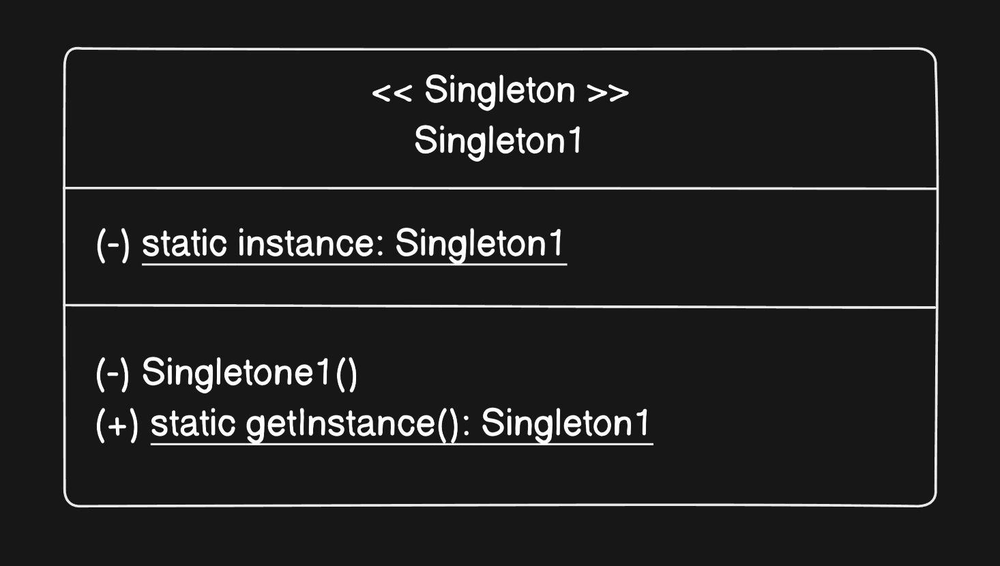

# Singleton Pattern

A TypeScript implementation of the **Singleton Design Pattern** demonstrating both eager and lazy initialization approaches.

## What is the Singleton Pattern?

The Singleton Pattern ensures a class has **only one instance** throughout the lifetime of an application, and provides a global point of access to it. The constructor is private — no external code can call `new`, so the single instance is always obtained through a controlled `getInstance()` method.

## The Problem it Solves

Some resources in an application must exist exactly once. Multiple instances of these cause real bugs:

- Two database connection pools competing for the same connections
- Two loggers writing to the same file with interleaved output
- Two config objects with different values for the same key due to different load times
- Two Redis clients holding different cache states

Without the singleton pattern, nothing stops this:

```typescript
const db1 = new DatabaseConnection()  // opens a connection pool
const db2 = new DatabaseConnection()  // opens another — now you have two
```

The singleton makes it structurally impossible:

```typescript
const db1 = DatabaseConnection.getInstance()
const db2 = DatabaseConnection.getInstance()
// db1 === db2 — guaranteed, same object
```

## UML Diagram



## The Two Approaches

### Eager Initialization

The instance is created when the class is first loaded — before `getInstance()` is ever called.

```typescript
export class Singleton1 {
    private static instance: Singleton1 = new Singleton1();

    private constructor() { }

    public static getInstance(): Singleton1 {
        return Singleton1.instance
    }
}
```

**Tradeoff:** The instance is always created, even if it is never used. Simple and safe, but wastes memory if the singleton is only needed in certain code paths.

### Lazy Initialization

The instance is created only on the first call to `getInstance()`.

```typescript
export class Singleton2 {
    private static instance: Singleton2 | undefined;

    private constructor() { }

    public static getInstance(): Singleton2 {
        if (!this.instance) {
            this.instance = new Singleton2()
        }
        return this.instance
    }
}
```

**Tradeoff:** Memory efficient — the instance is only created when actually needed. The `if` check adds a tiny overhead on every call, but this is negligible in practice. In multi-threaded languages (Java, C++) this check requires locking to be thread-safe; in TypeScript/JavaScript this is not a concern since JS is single-threaded.

### When to use which

| | Eager | Lazy |
|---|---|---|
| Instance always needed | Preferred | Works but wasteful |
| Instance sometimes needed | Wastes memory | Preferred |
| Initialization is expensive | Upfront cost at startup | Cost paid on first use |
| Simplicity | Simpler | Slightly more logic |

## Key Design Decisions

**`private constructor()`**
Blocks anyone from calling `new Singleton()` directly. The only way to get the instance is through `getInstance()` — this is what makes the guarantee enforceable.

**`private static instance`**
The instance lives on the class itself, not on any object. Since it's static, it's shared across all calls and persists for the lifetime of the program.

**`this` inside a static method refers to the class**
`this.instance` inside `getInstance()` is equivalent to `Singleton2.instance` — `this` in a static context refers to the class, not an object instance.

**`Singleton2 | undefined` for lazy**
The instance field is typed as `Singleton2 | undefined` — honest about the fact that it may not exist yet. The `if` check narrows the type before the return, so no unsafe non-null assertions are needed.

## How to Run

```bash
npm install
npx tsc
node dist/index.js
```

## When to Use the Singleton Pattern

- A resource must be shared and must exist exactly once (DB connection pool, logger, cache client)
- Global state needs a single controlled point of access
- Instantiation is expensive and should only happen once (reading config files, establishing connections)

## Real World Usage

**Logger**

A logging service should write all output to the same destination in the same order. Multiple logger instances would produce interleaved, unordered logs. The singleton ensures every part of the codebase writes through the same instance.

```typescript
class Logger {
    private static instance: Logger
    private logs: string[] = []

    private constructor() {}

    static getInstance(): Logger {
        if (!Logger.instance) Logger.instance = new Logger()
        return Logger.instance
    }

    log(message: string): void {
        const entry = `[${new Date().toISOString()}] ${message}`
        this.logs.push(entry)
        console.log(entry)
    }
}

// anywhere in the app — always the same logger
Logger.getInstance().log('Server started')
Logger.getInstance().log('Request received')
```

---

**Database Connection Pool**

Opening a new database connection is expensive — it involves a network handshake, authentication, and resource allocation. A connection pool should be created once and reused everywhere.

```typescript
import { Pool } from 'pg'

class DatabaseConnection {
    private static instance: DatabaseConnection
    private pool: Pool

    private constructor() {
        this.pool = new Pool({
            host: process.env.DB_HOST,
            database: process.env.DB_NAME,
            max: 10,
        })
    }

    static getInstance(): DatabaseConnection {
        if (!DatabaseConnection.instance) {
            DatabaseConnection.instance = new DatabaseConnection()
        }
        return DatabaseConnection.instance
    }

    getPool(): Pool {
        return this.pool
    }
}

// every service uses the same pool — no duplicate connections
const db = DatabaseConnection.getInstance().getPool()
await db.query('SELECT * FROM users')
```

---

**Redis Client**

A Redis client maintains a persistent TCP connection to the cache server. Creating multiple clients means multiple connections, multiple authentication handshakes, and potentially inconsistent cache state across the app.

```typescript
import { createClient, RedisClientType } from 'redis'

class RedisService {
    private static instance: RedisService
    private client: RedisClientType

    private constructor() {
        this.client = createClient({ url: process.env.REDIS_URL })
        this.client.connect()
    }

    static getInstance(): RedisService {
        if (!RedisService.instance) {
            RedisService.instance = new RedisService()
        }
        return RedisService.instance
    }

    async get(key: string): Promise<string | null> {
        return this.client.get(key)
    }

    async set(key: string, value: string, ttl?: number): Promise<void> {
        await this.client.set(key, value, { EX: ttl })
    }
}

const cache = RedisService.getInstance()
await cache.set('session:abc123', JSON.stringify(userData), 3600)
```

---

**App Configuration**

Config values are read once from environment variables or a config file. If different parts of the app read config independently, they could see different values if the environment changes mid-run. A singleton config ensures everyone reads from the same loaded snapshot.

```typescript
class AppConfig {
    private static instance: AppConfig
    private readonly config: Record<string, string>

    private constructor() {
        this.config = {
            port: process.env.PORT ?? '3000',
            env: process.env.NODE_ENV ?? 'development',
            jwtSecret: process.env.JWT_SECRET ?? '',
        }
    }

    static getInstance(): AppConfig {
        if (!AppConfig.instance) AppConfig.instance = new AppConfig()
        return AppConfig.instance
    }

    get(key: string): string {
        return this.config[key] ?? ''
    }
}

const config = AppConfig.getInstance()
console.log(config.get('port'))   // 3000
console.log(config.get('env'))    // development
```
